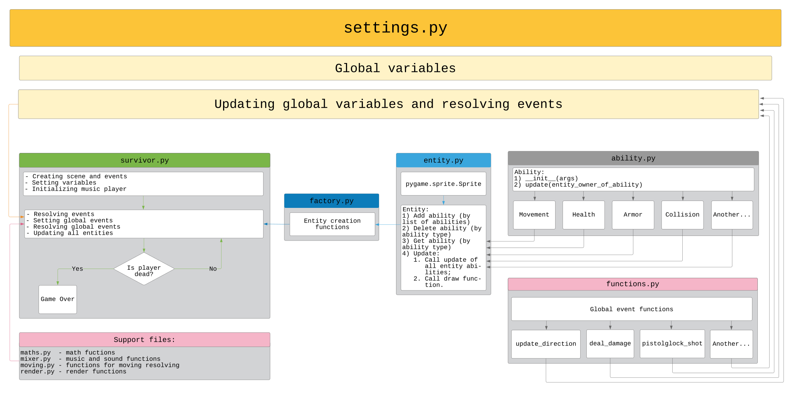

## About ##

It's a simple game were you must live as long as possible. A lot of zombies will try to kill you. The aim is to achieve the highest possible score.  
*The game was developed during the programming technologies course, that why it's simple. Designed only for FullHD*.

## How to play? ##

`WSAD` for moving, `Mouse` to look around, `Left mouse button` for shooting. You can change some constants by modifying `src/libs/settings.py`.

## Architecture ##

Game was developed using following patterns:

- **Singleton**
- **Command**
- **Builder**
- **Abstract factory**
- **Chain of responsibility** 

## What's the requirements? ##

You'll need the latest versions of `pygame` and `numpy`. After that, just open `src/survivor.py` and play!
